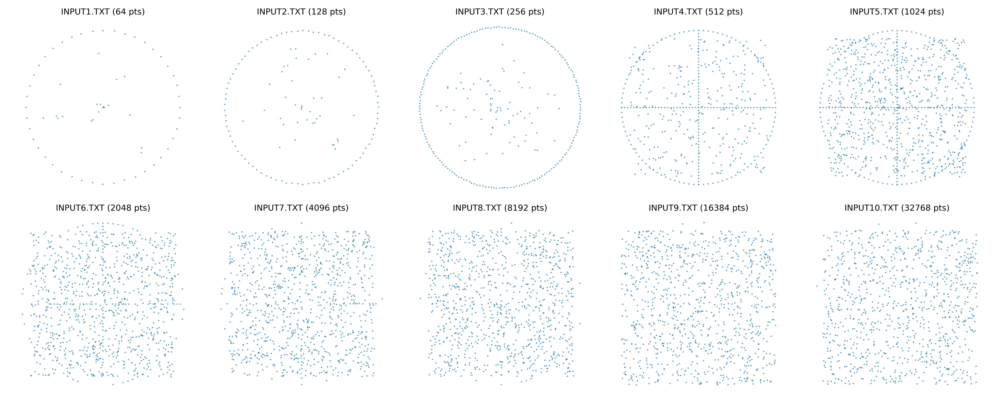

# Graham's Scan Convex Hull Implementation

A C implementation of Graham's scan algorithm for computing convex hulls, featuring performance comparison between bubble sort and merge sort preprocessing.

## Overview

This project implements Graham's scan algorithm with two different sorting approaches to demonstrate the performance impact of sorting efficiency on computational geometry algorithms. The implementation processes 2D point sets and outputs their convex hull vertices.

## Features

- **Dual Implementation:** Bubble sort (O(n²)) vs Merge sort (O(n log n)) preprocessing
- **Performance Testing:** Automated benchmarking across multiple input sizes (2⁶ to 2¹⁵ points)
- **Input Generation:** Configurable point pattern generation for testing
- **Cross-Platform:** Works on Windows, macOS, and Linux
- **Modular Design:** Clean separation of stack operations, sorting algorithms, and geometric computations

## Project Structure

```
graham-scan/
├── main1.c              # Driver for bubble sort implementation
├── main2.c              # Driver for merge sort implementation
├── graham_scan.h        # Main algorithm interface
├── graham_scan1.c       # Bubble sort Graham scan
├── graham_scan2.c       # Merge sort Graham scan
├── stack.h/.c           # Stack ADT implementation
├── sort.h/.c            # Sorting algorithms and geometry utilities
├── Makefile             # Build configuration
├── generate_inputs.py   # Test data generation script
├── test_automation.sh   # Unix/Linux testing script
├── test_automation.bat  # Windows testing script
├── images/              # Visual documentation
│   └── all_point_patterns.png  # Point distribution visualizations
└── data/                # Generated test input files
    ├── input2^6.txt     # 64 points
    ├── input2^7.txt     # 128 points
    └── ...              # Up to input2^15.txt (32,768 points)
```

## Installation

### Using Makefile (Recommended)

```bash
# Build both implementations
make all

# Build individual versions
make main1    # Bubble sort version
make main2    # Merge sort version

# For Windows
make windows
```

### Manual Compilation

```bash
# Bubble sort implementation
gcc -Wall -std=c99 -o main1 main1.c stack.c sort.c graham_scan1.c

# Merge sort implementation
gcc -Wall -std=c99 -o main2 main2.c stack.c sort.c graham_scan2.c
```

## Usage

### Basic Operation

```bash
# Interactive mode
./main1
# Enter: data/input2^6.txt
# Enter: output_slow.txt

./main2
# Enter: data/input2^6.txt
# Enter: output_fast.txt
```

### Automated Testing

```bash
# Generate test inputs
make generate_inputs

# Run performance tests
make test
```

### Input File Format

```
n
x1 y1
x2 y2
...
xn yn
```

Where `n` is the number of points, followed by n lines of coordinate pairs.

### Output File Format

```
m
x1 y1
x2 y2
...
xm ym
```

Where `m` is the number of hull vertices, followed by hull points in counterclockwise order.

## Test Data Patterns

The project generates diverse point distributions for comprehensive testing:



- **Circular Patterns** (datasets 2⁶-2⁸): Points distributed on circle perimeter with interior points
- **Mixed Patterns** (datasets 2⁹-2¹⁵): Complex distributions combining boundary, linear, and random elements

Each pattern is designed to test different aspects of the convex hull algorithm performance and correctness.

## Algorithm Details

### Graham's Scan Steps

1. **Anchor Selection:** Find bottommost-leftmost point
2. **Polar Sorting:** Sort remaining points by polar angle from anchor
3. **Hull Construction:** Use stack to maintain convex hull vertices
4. **Orientation Test:** Remove non-convex points using cross product

### Key Functions

- `orientation()`: Determines turn direction using cross product
- `distanceSquared()`: Handles collinear points by distance
- `bubbleSort()` / `mergeSort()`: Polar angle sorting implementations
- Stack operations: `PUSH()`, `POP()`, `TOP()`, `NEXT_TO_TOP()`

## Performance Analysis

The project demonstrates the significant impact of sorting efficiency:

- **Bubble Sort:** O(n²) preprocessing + O(n) hull construction = O(n²)
- **Merge Sort:** O(n log n) preprocessing + O(n) hull construction = O(n log n)

Test cases range from 64 to 32,768 points, clearly showing the performance divergence as input size grows.

## Makefile Commands

### Build Commands
```bash
make all              # Build both implementations
make main1            # Build bubble sort version
make main2            # Build merge sort version
make windows          # Build Windows executables
```

### Utility Commands
```bash
make generate_inputs  # Create test data files
make test            # Run automated performance tests
make run             # Show usage examples
make help            # Display all available commands
```

### Cleanup Commands
```bash
make clean           # Remove all generated files
make clean_executables # Remove only executable files
make input_clean     # Remove data directory
make output_clean    # Remove results directory
```

## Input Generation

The Python script `generate_inputs.py` creates test files with varying point distributions:

- **Circular patterns** (smaller datasets): Points on circle perimeter with interior points
- **Mixed patterns** (larger datasets): Combination of boundary, linear, and random points
- **Scalable coordinates:** Larger coordinate ranges for bigger datasets

Generated files are stored in the `data/` directory and visualized in `images/all_point_patterns.png`.

## Dependencies

- **Compiler:** GCC with C99 support
- **Python 3:** For input generation (optional)
- **Make:** For automated building (optional)

## Error Handling

The implementation includes comprehensive error checking:

- File operation validation
- Stack boundary checking
- Insufficient point detection (minimum 3 points required)
- Memory access protection

## Git Commit Conventions

This project follows conventional commit types:

| Type | Purpose |
|------|---------|
| `feat` | Add new feature (functions, logic) |
| `fix` | Fix bugs (incorrect output, logic errors) |
| `refactor` | Improve code without changing behavior |
| `perf` | Optimize performance |
| `style` | Formatting changes |
| `test` | Add or update test cases |
| `build` | Modify Makefile or compilation setup |
| `docs` | Update documentation |
| `chore` | Non-code maintenance tasks |

